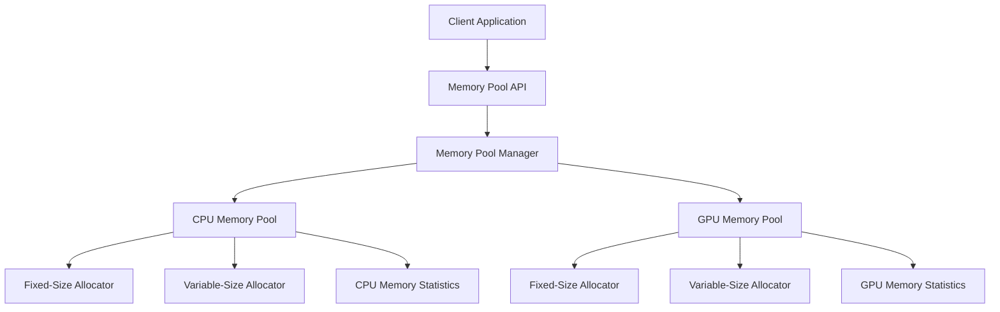
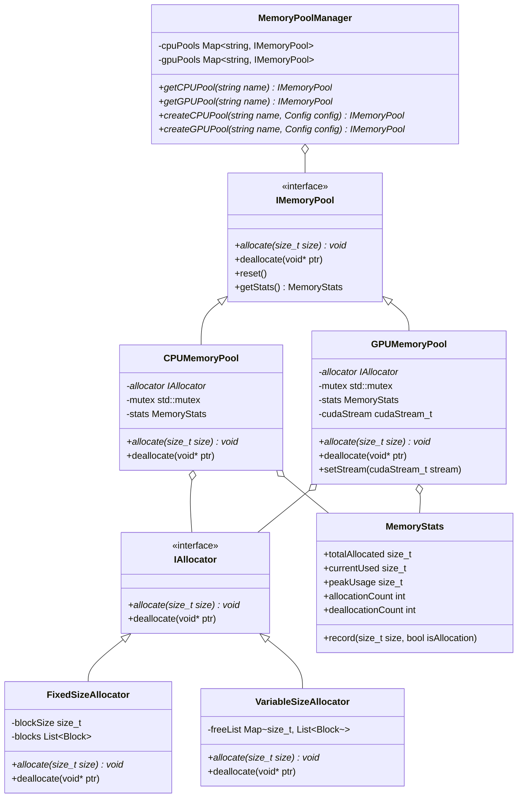

# Memory Pool Management System Development Plan

## Overview

This document outlines the development plan and architecture for a high-performance memory pool management system implemented in C++ that supports both CPU and GPU (CUDA) memory management. The library is designed to be a general-purpose solution for high-performance computing applications that require efficient memory management across different hardware.

## Core Requirements

1. **Cross-Hardware Support**:
   - CPU memory pool management
   - GPU memory pool management via CUDA (compatible with CUDA 11.0+)
   - Seamless integration between CPU and GPU memory operations

2. **Allocation Strategies**:
   - Fixed-size block allocation
   - Variable-size allocation
   - Configurable allocation policies

3. **Thread Safety**:
   - Support for multi-threaded applications
   - Lock-based and lock-free synchronization options
   - Thread-local storage options for high-performance scenarios

4. **Memory Tracking and Statistics**:
   - Memory usage tracking
   - Allocation/deallocation statistics
   - Performance metrics

5. **Debugging Capabilities**:
   - Memory leak detection
   - Boundary checking
   - Allocation history tracking

## System Architecture

### High-Level Architecture



### Component Breakdown

1. **Memory Pool API**:
   - Unified interface for memory allocation and deallocation
   - Hardware-agnostic memory operations
   - Configuration and policy setting

2. **Memory Pool Manager**:
   - Central coordination of memory pools
   - Resource management and optimization
   - Cross-device memory operations

3. **CPU Memory Pool**:
   - Management of host memory
   - Implementation of allocation strategies
   - Thread safety mechanisms

4. **GPU Memory Pool**:
   - Management of device memory via CUDA
   - CUDA-specific optimizations
   - Asynchronous operations support

5. **Allocators**:
   - Fixed-size block allocator
   - Variable-size allocator
   - Custom allocation policies

6. **Memory Statistics**:
   - Usage tracking
   - Performance monitoring
   - Debugging information

## Class Hierarchy



## Implementation Details

### CPU Memory Pool

1. **Fixed-Size Block Allocator**:
   - Pre-allocates memory in chunks
   - Divides chunks into fixed-size blocks
   - Maintains free list of available blocks
   - O(1) allocation and deallocation time complexity

2. **Variable-Size Allocator**:
   - Segregated free lists for different size classes
   - Coalescing of adjacent free blocks
   - Best-fit or first-fit allocation strategy
   - Boundary tags for efficient coalescing

3. **Thread Safety**:
   - Mutex-based synchronization for general operations
   - Lock-free operations for performance-critical paths
   - Thread-local caching for reducing contention

### GPU Memory Pool (CUDA)

1. **CUDA Memory Management**:
   - Wrapper around cudaMalloc/cudaFree
   - Support for different CUDA memory types (global, shared, etc.)
   - Integration with CUDA streams for asynchronous operations

2. **Fixed-Size Block Allocator**:
   - Similar to CPU version but optimized for GPU memory
   - Consideration of GPU memory alignment requirements
   - Support for pinned memory for efficient host-device transfers

3. **Variable-Size Allocator**:
   - Adaptation of CPU strategies for GPU memory
   - Consideration of GPU-specific constraints
   - Optimization for common GPU workload patterns

4. **Thread Safety**:
   - CUDA-aware synchronization mechanisms
   - Support for concurrent kernel execution
   - Coordination with CUDA stream operations

### Memory Tracking and Statistics

1. **Usage Tracking**:
   - Current memory usage
   - Peak memory usage
   - Allocation patterns

2. **Performance Metrics**:
   - Allocation/deallocation latency
   - Memory fragmentation
   - Cache hit rates

3. **Debugging Information**:
   - Allocation stack traces
   - Memory leak detection
   - Boundary violation detection

## Error Handling

1. **Exception Handling**:
   - Custom exception hierarchy
   - Detailed error information
   - Recovery strategies

2. **Error Codes**:
   - Comprehensive error code system
   - Descriptive error messages
   - Error categorization

3. **Logging**:
   - Configurable logging levels
   - Performance impact considerations
   - Integration with external logging systems

## Project Structure

```
memory-pool/
├── include/
│   ├── memory_pool/
│   │   ├── common.hpp
│   │   ├── config.hpp
│   │   ├── memory_pool.hpp
│   │   ├── cpu/
│   │   │   ├── cpu_memory_pool.hpp
│   │   │   ├── fixed_size_allocator.hpp
│   │   │   └── variable_size_allocator.hpp
│   │   ├── gpu/
│   │   │   ├── gpu_memory_pool.hpp
│   │   │   ├── cuda_allocator.hpp
│   │   │   └── cuda_utils.hpp
│   │   ├── stats/
│   │   │   ├── memory_stats.hpp
│   │   │   └── performance_tracker.hpp
│   │   └── utils/
│   │       ├── thread_safety.hpp
│   │       ├── debug_tools.hpp
│   │       └── error_handling.hpp
├── src/
│   ├── common.cpp
│   ├── memory_pool_manager.cpp
│   ├── cpu/
│   │   ├── cpu_memory_pool.cpp
│   │   ├── fixed_size_allocator.cpp
│   │   └── variable_size_allocator.cpp
│   ├── gpu/
│   │   ├── gpu_memory_pool.cpp
│   │   ├── cuda_allocator.cpp
│   │   └── cuda_utils.cpp
│   ├── stats/
│   │   ├── memory_stats.cpp
│   │   └── performance_tracker.cpp
│   └── utils/
│       ├── thread_safety.cpp
│       ├── debug_tools.cpp
│       └── error_handling.cpp
├── tests/
│   ├── unit/
│   │   ├── cpu_tests.cpp
│   │   ├── gpu_tests.cpp
│   │   └── manager_tests.cpp
│   ├── integration/
│   │   ├── cpu_gpu_integration_tests.cpp
│   │   └── thread_safety_tests.cpp
│   └── performance/
│       ├── cpu_benchmarks.cpp
│       ├── gpu_benchmarks.cpp
│       └── comparison_benchmarks.cpp
├── examples/
│   ├── basic_usage.cpp
│   ├── advanced_usage.cpp
│   └── gpu_examples.cpp
├── docs/
│   ├── api/
│   │   └── README.md
│   ├── design/
│   │   ├── architecture.md
│   │   ├── allocation_strategies.md
│   │   └── performance_guidelines.md
│   └── examples/
│       ├── best_practices.md
│       └── getting_started.md
├── CMakeLists.txt
├── LICENSE
└── README.md
```

## API Design

### Core API

```cpp
// Memory Pool Interface
class IMemoryPool {
public:
    virtual ~IMemoryPool() = default;
    
    // Core allocation functions
    virtual void* allocate(size_t size) = 0;
    virtual void deallocate(void* ptr) = 0;
    
    // Pool management
    virtual void reset() = 0;
    virtual MemoryStats getStats() const = 0;
};

// Memory Pool Manager
class MemoryPoolManager {
public:
    // CPU pool management
    IMemoryPool* getCPUPool(const std::string& name);
    IMemoryPool* createCPUPool(const std::string& name, const PoolConfig& config);
    
    // GPU pool management
    IMemoryPool* getGPUPool(const std::string& name);
    IMemoryPool* createGPUPool(const std::string& name, const PoolConfig& config);
    
    // Global operations
    void resetAllPools();
    std::map<std::string, MemoryStats> getAllStats() const;
    
    // Singleton access
    static MemoryPoolManager& getInstance();
};

// Configuration
struct PoolConfig {
    enum class AllocatorType {
        FixedSize,
        VariableSize
    };
    
    AllocatorType allocatorType = AllocatorType::VariableSize;
    size_t initialSize = 1024 * 1024;  // 1MB default
    size_t blockSize = 256;            // For fixed-size allocator
    bool threadSafe = true;
    bool trackStats = true;
    bool enableDebugging = false;
    
    // GPU-specific options
    int deviceId = 0;                  // CUDA device ID
    bool usePinnedMemory = false;      // Use pinned memory for CPU-GPU transfers
};
```

### Usage Examples

```cpp
// Basic CPU memory pool usage
void cpuExample() {
    auto& manager = MemoryPoolManager::getInstance();
    
    // Create a CPU memory pool with default configuration
    PoolConfig config;
    auto* pool = manager.createCPUPool("main_cpu_pool", config);
    
    // Allocate memory
    void* data = pool->allocate(1024);
    
    // Use the memory...
    
    // Deallocate memory
    pool->deallocate(data);
    
    // Get memory statistics
    MemoryStats stats = pool->getStats();
    std::cout << "Total allocated: " << stats.totalAllocated << std::endl;
    std::cout << "Current used: " << stats.currentUsed << std::endl;
}

// Basic GPU memory pool usage
void gpuExample() {
    auto& manager = MemoryPoolManager::getInstance();
    
    // Create a GPU memory pool with custom configuration
    PoolConfig config;
    config.allocatorType = PoolConfig::AllocatorType::FixedSize;
    config.blockSize = 1024;
    config.deviceId = 0;  // Use first CUDA device
    
    auto* pool = manager.createGPUPool("main_gpu_pool", config);
    
    // Allocate GPU memory
    void* deviceData = pool->allocate(1024 * 10);
    
    // Use the memory with CUDA kernels...
    
    // Deallocate memory
    pool->deallocate(deviceData);
}
```

## Testing Strategy

1. **Unit Testing**:
   - Test individual components in isolation
   - Mock dependencies for controlled testing
   - Cover all edge cases and error conditions

2. **Integration Testing**:
   - Test interaction between components
   - Verify cross-device memory operations
   - Test thread safety in multi-threaded scenarios

3. **Performance Testing**:
   - Benchmark against standard allocators (malloc/free, new/delete)
   - Measure allocation/deallocation latency
   - Evaluate memory fragmentation
   - Test under various workload patterns

4. **Stress Testing**:
   - Test under high memory pressure
   - Test with extreme allocation patterns
   - Test recovery from out-of-memory conditions

## Current Development Status

### Completed Features ✅
- **Project Structure**: Complete directory structure with include/, src/, tests/, examples/, and docs/
- **Build System**: CMake configuration with CUDA support, compiler flags, and target definitions
- **CPU Memory Pool**: Full implementation with fixed-size and variable-size allocators
- **GPU Memory Pool**: Basic implementation with CUDA integration and stream management
- **Memory Pool Manager**: Singleton manager with CPU/GPU pool creation and management
- **Thread Safety**: Basic mutex-based synchronization for multi-threaded operations
- **Memory Statistics**: Basic allocation/deallocation tracking and reporting
- **Error Handling**: Custom exception hierarchy and error reporting system
- **CUDA Utilities**: Device management, stream operations, and memory copy utilities
- **Basic Testing**: Initial unit tests for CPU functionality
- **Examples**: Basic usage examples for CPU and GPU memory pools
- **CUDA Allocators**: Full implementation of CudaFixedSizeAllocator and CudaVariableSizeAllocator
- **Performance Monitoring**: Advanced performance tracking and metrics collection
- **Advanced Examples**: Multi-threading, performance tuning, and error handling examples
- **Documentation**: Comprehensive API documentation with Doxygen, design documentation, and usage guides

### In Progress 🚧
(None - All development phases completed)

### Ready for Release 🚀
- Final comprehensive testing and validation
- Create release package (tar.gz with headers, libs, examples)
- Version tagging and deployment

## Development Timeline and Milestones

### Phase 1: Core Implementation ✅ COMPLETED
- Set up project structure and build system
- Implement basic CPU memory pool with fixed-size allocator
- Implement basic thread safety mechanisms
- Create initial unit tests

### Phase 2: GPU Implementation ✅ COMPLETED
- Implement basic GPU memory pool with CUDA integration ✅
- Develop CUDA-specific utilities and helpers ✅
- Implement CUDA allocators (CudaFixedSizeAllocator, CudaVariableSizeAllocator) ✅
- Extend unit tests to cover GPU functionality ✅
- Create basic integration tests for CPU-GPU interaction ✅

### Phase 3: Advanced Features ✅ COMPLETED
- Implement variable-size allocators for both CPU and GPU ✅
- Enhance thread safety mechanisms with lock-free options ✅
- Implement complete memory tracking and statistics ✅
- Develop debugging tools and error handling ✅

### Phase 4: Optimization and Testing ✅ COMPLETED
- Optimize performance for common use cases ✅
- Implement advanced allocation strategies ✅
- Conduct comprehensive testing (unit, integration, performance) ✅
- Fix bugs and address performance issues ✅

### Phase 5: Documentation and Examples ✅ COMPLETED
- Create comprehensive API documentation ✅
- Develop usage examples and tutorials ✅
- Write design documentation ✅
- Prepare for release ✅

## Conclusion

This memory pool management system will provide a high-performance, flexible solution for applications that require efficient memory management across CPU and GPU. By supporting both fixed-size and variable-size allocations, ensuring thread safety, and providing comprehensive memory tracking and debugging capabilities, the library will meet the needs of a wide range of high-performance computing applications.

The modular design allows for easy extension and customization, while the unified API simplifies usage across different hardware. The comprehensive testing strategy ensures reliability and performance, making this a robust solution for memory management in demanding applications.