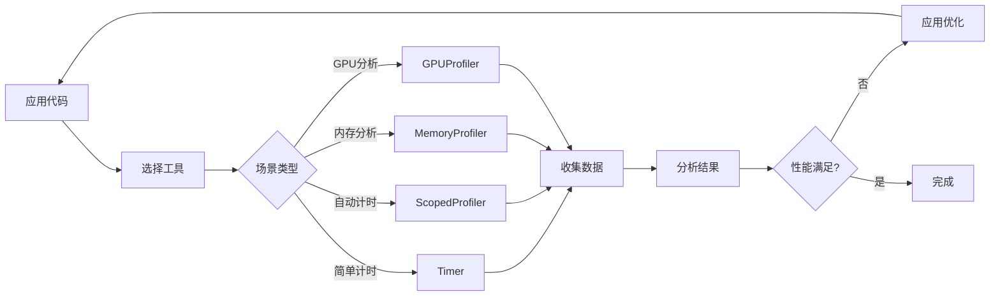

# 性能分析工具和指南 - 规划文档索引

## 📂 文档概览

本目录包含实现"添加性能分析指南和工具"功能的完整规划文档。

---

## 📄 文档列表

### 1. [实施计划详情](profiling_implementation_plan.md)
**主要文档** - 完整的技术实施计划

**内容包括**:
- 当前状态分析（优势与差距）
- 实施架构设计
- 详细的功能规格
- 文件结构和构建系统变更
- 性能考虑和风险分析
- 成功标准和时间线

**适用对象**: 技术负责人、开发人员

**关键亮点**:
- 5个核心工具类的完整规格
- 详细的API设计
- 构建系统集成方案
- 跨平台兼容性考虑

---

### 2. [用例和示例详解](profiling_use_cases_and_examples.md)
**实用指南** - 真实场景和详细代码示例

**内容包括**:
- 3个真实应用场景:
  - 游戏引擎粒子系统
  - 深度学习GPU内存管理
  - Web服务器并发请求处理
- 10+ 详细代码示例
- 性能优化工作流
- 常见问题诊断指南
- 最佳实践模式

**适用对象**: 应用开发者、用户

**关键亮点**:
- 可直接使用的代码模板
- 实际性能数据和对比
- 问题诊断流程图
- RAII和自动化模式

---

### 3. [实施检查清单](profiling_implementation_checklist.md)
**执行指南** - 逐步实施任务清单

**内容包括**:
- 7个实施阶段的详细任务
- 每个任务的验收标准
- 进度追踪表格
- 质量检查清单
- 审阅要点

**适用对象**: 项目经理、实施团队

**关键亮点**:
- 可追踪的任务项（18个主要任务）
- 明确的验收标准
- 质量保证检查点
- 进度可视化

---

## 🎯 快速导航

### 如果您想了解...

#### "这个功能要做什么？"
→ 阅读 [实施计划详情](profiling_implementation_plan.md) 的执行摘要和架构部分

#### "如何使用这些工具？"
→ 查看 [用例和示例详解](profiling_use_cases_and_examples.md) 的代码示例部分

#### "实施步骤是什么？"
→ 使用 [实施检查清单](profiling_implementation_checklist.md) 作为执行指南

#### "需要创建哪些文件？"
```
新增文件:
├── include/memory_pool/utils/profiling_tools.hpp    [核心工具头文件]
├── src/utils/profiling_tools.cpp                    [核心工具实现]
├── examples/profiling_example.cpp                   [基础示例]
├── examples/advanced_profiling.cpp                  [高级示例]
├── docs/guides/profiling_guide.md                   [用户指南]
└── docs/guides/external_profiling_tools.md          [工具集成指南]

修改文件:
├── CMakeLists.txt                                   [构建配置]
├── docs/design/performance_guidelines.md            [性能指南]
└── docs/examples/best_practices.md                  [最佳实践]
```

---

## 📊 功能组件一览

### 核心工具类

| 类名 | 用途 | 关键特性 |
|-----|------|---------|
| `Timer` | 高精度计时 | 微秒级精度，跨平台 |
| `ScopedProfiler` | RAII自动计时 | 作用域自动输出 |
| `PerformanceCounter` | 统计分析 | 最小/最大/平均/标准差 |
| `MemoryProfiler` | 内存操作分析 | 分配模式，带宽计算 |
| `GPUProfiler` | GPU性能分析 | CUDA事件，带宽测量 |

### 文档结构

```
docs/guides/
├── profiling_guide.md              (~3000 词)
│   ├── 1. 引言和动机
│   ├── 2. 内置工具使用
│   ├── 3. 常见分析场景
│   ├── 4. 结果解读
│   ├── 5. 最佳实践
│   ├── 6. 优化工作流
│   └── 7. 故障排除
│
└── external_profiling_tools.md     (~2500 词)
    ├── 1. Valgrind 集成
    ├── 2. Linux perf 使用
    ├── 3. NVIDIA Nsight
    ├── 4. Visual Studio Profiler
    ├── 5. Intel VTune
    └── 6. 自定义集成
```

---

## 🎨 架构可视化

### 工具类关系图

```
┌─────────────────────────────────────────────┐
│         Memory Pool System                  │
│                                             │
│  ┌─────────────────────────────────────┐  │
│  │      Profiling Tools Layer          │  │
│  │                                     │  │
│  │  ┌──────────┐  ┌──────────────┐  │  │
│  │  │  Timer   │  │PerformanceCounter│  │
│  │  └─────┬────┘  └────────┬────────┘  │  │
│  │        │                │            │  │
│  │  ┌─────▼────────────────▼────────┐  │  │
│  │  │    ScopedProfiler             │  │  │
│  │  └───────────────────────────────┘  │  │
│  │        │                             │  │
│  │  ┌─────▼────────┐  ┌──────────────┐│  │
│  │  │MemoryProfiler│  │  GPUProfiler ││  │
│  │  └──────────────┘  └──────────────┘│  │
│  └─────────────────────────────────────┘  │
│                                             │
│  ┌─────────────────────────────────────┐  │
│  │   Memory Pools (CPU/GPU/Custom)     │  │
│  └─────────────────────────────────────┘  │
└─────────────────────────────────────────────┘
```

### 使用工作流



---

## ✅ 关键成功因素

### 技术质量
- ✓ 零开销 (禁用时)
- ✓ 高精度（< 100ns）
- ✓ 线程安全
- ✓ 跨平台兼容

### 文档质量
- ✓ 清晰的示例
- ✓ 循序渐进的教程
- ✓ 实际应用场景
- ✓ 故障排除指南

### 用户体验
- ✓ 简单易用的API
- ✓ RAII模式支持
- ✓ 灵活配置
- ✓ 详细的输出

---

## 📈 预期收益

### 对用户
1. **更容易优化**: 清晰的性能瓶颈识别
2. **更快调试**: 快速定位内存问题
3. **更好决策**: 数据驱动的配置选择
4. **学习资源**: 完整的示例和指南

### 对项目
1. **功能完整性**: 补齐性能工具链
2. **用户满意度**: 实用的辅助工具
3. **社区贡献**: 吸引更多用户
4. **最佳实践**: 建立性能标准

---

## 🚀 实施准备

### 开始前的检查

- [ ] 理解整体架构和目标
- [ ] 审阅所有三个规划文档
- [ ] 准备开发环境（CUDA、编译器等）
- [ ] 熟悉现有代码库结构
- [ ] 准备测试环境和工具

### 建议的实施顺序

1. **第一周**: 核心工具实现（Timer, PerformanceCounter等）
2. **第二周**: 示例程序和基础测试
3. **第三周**: 文档编写和高级示例
4. **第四周**: 集成测试、审查和完善

---

## 📞 支持和资源

### 参考资源
- [Memory Pool 主README](../README.md)
- [开发计划](../develop_plan.md)
- [TODO列表](../todo_list.md)
- [性能指南](../docs/design/performance_guidelines.md)

### 外部文档
- [std::chrono 文档](https://en.cppreference.com/w/cpp/chrono)
- [CUDA Events API](https://docs.nvidia.com/cuda/cuda-runtime-api/group__CUDART__EVENT.html)
- [Valgrind 手册](https://valgrind.org/docs/manual/)
- [Linux perf Wiki](https://perf.wiki.kernel.org/)

---

## 📝 版本历史

| 版本 | 日期 | 变更说明 |
|-----|------|---------|
| 1.0 | 2025-12-31 | 初始规划文档创建 |

---

## 🤝 下一步行动

### 对于评审者
1. 审查三个规划文档
2. 提供反馈和建议
3. 批准或要求修改

### 对于实施者
1. 确认理解所有要求
2. 准备开发环境
3. 开始按检查清单执行
4. 定期更新进度

---

**准备好开始了吗？** 

👉 首先阅读 [实施计划详情](profiling_implementation_plan.md)  
👉 然后查看 [实施检查清单](profiling_implementation_checklist.md)  
👉 最后切换到 **Code 模式** 开始实现！

---

*本文档是性能分析工具实施计划的导航索引，包含了完成该功能所需的所有规划信息。*
