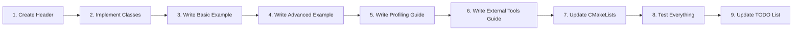

# Performance Profiling Guides and Tools - Implementation Plan

## Executive Summary

This plan outlines the implementation of comprehensive performance profiling guides and tools for the Memory Pool Management System. The goal is to help users optimize their applications by providing:

1. **Profiling Tools**: Utility classes and macros for performance measurement
2. **Example Code**: Practical examples demonstrating profiling techniques
3. **Documentation**: Comprehensive guides for profiling CPU and GPU memory operations
4. **External Tool Integration**: Guides for using industry-standard profiling tools

## Current State Analysis

### Existing Infrastructure

**Strengths:**
- ✅ [`MemoryStats`](../include/memory_pool/stats/memory_stats.hpp) class provides allocation tracking
- ✅ Basic benchmarking in [`comparison_benchmarks.cpp`](../tests/performance/comparison_benchmarks.cpp)
- ✅ Performance guidelines in [`performance_guidelines.md`](../docs/design/performance_guidelines.md)
- ✅ Statistics monitoring integrated in pool implementations

**Gaps Identified:**
- ❌ No dedicated profiling utilities (timing, scoped profilers)
- ❌ No profiling-specific example code
- ❌ Missing comprehensive profiling guide documentation
- ❌ No integration guides for external tools (Valgrind, perf, Nsight)
- ❌ Limited real-world profiling scenarios

## Implementation Architecture

### 1. Profiling Tools Library

#### 1.1 ProfilingTools Header ([`include/memory_pool/utils/profiling_tools.hpp`](../include/memory_pool/utils/profiling_tools.hpp))

**Components:**

```cpp
namespace memory_pool {
namespace profiling {

// High-resolution timer
class Timer {
    // Start/stop timing
    // Get elapsed time in various units
    // Reset functionality
};

// RAII-based scoped profiler
class ScopedProfiler {
    // Constructor starts timer
    // Destructor prints results
    // Configurable output format
};

// Performance counter
class PerformanceCounter {
    // Track operation counts
    // Calculate rates (ops/sec)
    // Statistical analysis (min/max/avg)
};

// Memory operation profiler
class MemoryProfiler {
    // Track allocation patterns
    // Measure allocation latency
    // Monitor memory bandwidth
    // Fragmentation analysis
};

// GPU-specific profiling
class GPUProfiler {
    // CUDA event-based timing
    // Memory transfer profiling
    // Kernel execution timing
    // Stream synchronization points
};

} // namespace profiling
} // namespace memory_pool
```

**Features:**
- Thread-safe counters using atomics
- Minimal overhead for production use
- Optional compile-time enable/disable
- Cross-platform compatibility

#### 1.2 Profiling Macros

```cpp
// Conditional compilation macros
#ifdef ENABLE_PROFILING
    #define PROFILE_SCOPE(name) ScopedProfiler profiler_##name(#name)
    #define PROFILE_FUNCTION() PROFILE_SCOPE(__FUNCTION__)
    #define PROFILE_BEGIN(name) Timer timer_##name; timer_##name.start()
    #define PROFILE_END(name) timer_##name.stop(); /* output results */
#else
    // No-op when profiling disabled
#endif
```

### 2. Profiling Examples

#### 2.1 Basic Profiling Example ([`examples/profiling_example.cpp`](../examples/profiling_example.cpp))

**Scenarios covered:**
- Measuring allocation/deallocation latency
- Comparing fixed-size vs variable-size allocators
- Thread contention analysis
- Memory bandwidth measurement
- Fragmentation monitoring

**Code structure:**
```cpp
void profileAllocationLatency() {
    // Demonstrate Timer usage
    // Show statistical analysis
}

void profileMemoryBandwidth() {
    // Measure throughput
    // Compare different patterns
}

void profileFragmentation() {
    // Long-running scenario
    // Track fragmentation over time
}

void profileThreadContention() {
    // Multi-threaded workload
    // Lock contention analysis
}

void profileGPUOperations() {
    // CUDA event timing
    // Transfer bandwidth
    // Kernel execution
}
```

#### 2.2 Advanced Profiling Example ([`examples/advanced_profiling.cpp`](../examples/advanced_profiling.cpp))

**Advanced scenarios:**
- Real-world workload simulation
- Multi-GPU profiling
- NUMA-aware profiling
- Custom allocator profiling
- Integration with external tools

### 3. Documentation

#### 3.1 Profiling Guide ([`docs/guides/profiling_guide.md`](../docs/guides/profiling_guide.md))

**Table of Contents:**

1. **Introduction**
   - Why profile memory operations
   - When to profile
   - Profiling methodology

2. **Built-in Profiling Tools**
   - Using Timer class
   - ScopedProfiler for automatic timing
   - PerformanceCounter for statistics
   - MemoryProfiler for allocation patterns
   - GPUProfiler for CUDA operations

3. **Common Profiling Scenarios**
   - Allocation latency measurement
   - Memory bandwidth testing
   - Fragmentation analysis
   - Thread contention detection
   - GPU transfer optimization

4. **Interpreting Results**
   - Understanding latency numbers
   - Identifying bottlenecks
   - Comparing configurations
   - Making optimization decisions

5. **Best Practices**
   - Warm-up iterations
   - Statistical significance
   - Isolating variables
   - Reproducible benchmarks
   - Production vs development profiling

6. **Performance Optimization Workflow**
   ```mermaid
   graph TD
       A[Identify Performance Goal] --> B[Baseline Measurement]
       B --> C[Profile Critical Paths]
       C --> D[Identify Bottlenecks]
       D --> E[Apply Optimization]
       E --> F[Measure Improvement]
       F --> G{Goal Met?}
       G -->|No| C
       G -->|Yes| H[Document Results]
   ```

7. **Troubleshooting Common Issues**
   - High allocation latency
   - Memory fragmentation
   - Thread contention
   - GPU transfer bottlenecks

#### 3.2 External Tools Integration Guide ([`docs/guides/external_profiling_tools.md`](../docs/guides/external_profiling_tools.md))

**Sections:**

1. **Memory Profiling with Valgrind**
   - Installation and setup
   - Running memcheck for leak detection
   - Using massif for heap profiling
   - Interpreting results
   - Integration with CI/CD

2. **CPU Profiling with perf**
   - Linux perf basics
   - Profiling CPU allocators
   - Call graph analysis
   - Cache miss analysis
   - Flame graph generation

3. **GPU Profiling with NVIDIA Nsight**
   - Nsight Systems for timeline analysis
   - Nsight Compute for kernel profiling
   - Memory transfer profiling
   - Finding optimization opportunities

4. **Visual Studio Profiler (Windows)**
   - CPU profiling
   - Memory profiling
   - Performance analysis

5. **Intel VTune**
   - Microarchitecture analysis
   - Memory access patterns
   - Threading analysis

6. **Custom Profiling Integration**
   - Google Benchmark integration
   - Tracy profiler integration
   - Custom metrics collection

### 4. Implementation Details

#### 4.1 File Structure

```
memory-pool/
├── include/memory_pool/utils/
│   └── profiling_tools.hpp          [NEW]
├── src/utils/
│   └── profiling_tools.cpp          [NEW]
├── examples/
│   ├── profiling_example.cpp        [NEW]
│   └── advanced_profiling.cpp       [NEW]
├── docs/guides/
│   ├── profiling_guide.md           [NEW]
│   └── external_profiling_tools.md  [NEW]
└── CMakeLists.txt                   [MODIFIED]
```

#### 4.2 Build System Changes

**CMakeLists.txt modifications:**

```cmake
# Add profiling tools to library sources
list(APPEND SOURCES src/utils/profiling_tools.cpp)

# Add compile definition for profiling
option(ENABLE_PROFILING "Enable profiling instrumentation" OFF)
if(ENABLE_PROFILING)
    add_definitions(-DENABLE_PROFILING)
endif()

# Add profiling examples
if(BUILD_EXAMPLES)
    add_executable(profiling_example examples/profiling_example.cpp)
    target_link_libraries(profiling_example memory_pool)
    
    add_executable(advanced_profiling_example examples/advanced_profiling.cpp)
    target_link_libraries(advanced_profiling_example memory_pool)
endif()
```

#### 4.3 Dependencies

**Required:**
- C++17 `<chrono>` for high-resolution timing
- `<atomic>` for thread-safe counters
- CUDA runtime for GPU profiling

**Optional:**
- Google Benchmark (for advanced benchmarking)
- Tracy profiler (for visual profiling)

### 5. Feature Specifications

#### 5.1 Timer Class

```cpp
class Timer {
public:
    // Start timing
    void start();
    
    // Stop timing
    void stop();
    
    // Reset timer
    void reset();
    
    // Get elapsed time
    double elapsed_microseconds() const;
    double elapsed_milliseconds() const;
    double elapsed_seconds() const;
    
    // Check if running
    bool is_running() const;
    
private:
    std::chrono::high_resolution_clock::time_point start_time_;
    std::chrono::high_resolution_clock::time_point end_time_;
    bool running_;
};
```

#### 5.2 ScopedProfiler Class

```cpp
class ScopedProfiler {
public:
    // Constructor starts timer
    explicit ScopedProfiler(const std::string& name, 
                           std::ostream& out = std::cout);
    
    // Destructor prints results
    ~ScopedProfiler();
    
    // Disable copy/move
    ScopedProfiler(const ScopedProfiler&) = delete;
    ScopedProfiler& operator=(const ScopedProfiler&) = delete;
    
private:
    std::string name_;
    Timer timer_;
    std::ostream& output_;
};
```

#### 5.3 PerformanceCounter Class

```cpp
class PerformanceCounter {
public:
    // Record an operation with its duration
    void record(double duration_us);
    
    // Get statistics
    size_t count() const;
    double min() const;
    double max() const;
    double average() const;
    double std_deviation() const;
    double total() const;
    
    // Calculate throughput
    double operations_per_second() const;
    
    // Reset all counters
    void reset();
    
    // Print summary
    std::string summary() const;
    
private:
    std::atomic<size_t> count_;
    std::atomic<double> total_time_;
    std::atomic<double> min_time_;
    std::atomic<double> max_time_;
    std::mutex stats_mutex_;
    std::vector<double> samples_;  // For std deviation
};
```

#### 5.4 MemoryProfiler Class

```cpp
class MemoryProfiler {
public:
    // Track allocation
    void record_allocation(size_t size, double duration_us);
    
    // Track deallocation
    void record_deallocation(size_t size, double duration_us);
    
    // Get allocation statistics
    const PerformanceCounter& alloc_stats() const;
    const PerformanceCounter& dealloc_stats() const;
    
    // Get size distribution
    std::map<size_t, size_t> size_histogram() const;
    
    // Calculate bandwidth
    double allocation_bandwidth_mbps() const;
    double deallocation_bandwidth_mbps() const;
    
    // Generate report
    std::string generate_report() const;
    
private:
    PerformanceCounter alloc_counter_;
    PerformanceCounter dealloc_counter_;
    std::map<size_t, size_t> size_histogram_;
    std::atomic<size_t> total_bytes_allocated_;
    std::atomic<size_t> total_bytes_deallocated_;
};
```

#### 5.5 GPUProfiler Class

```cpp
class GPUProfiler {
public:
    // Constructor/Destructor manage CUDA events
    GPUProfiler();
    ~GPUProfiler();
    
    // Record kernel execution
    void start_kernel_timing();
    void stop_kernel_timing();
    float get_kernel_time_ms() const;
    
    // Record memory transfer
    void start_transfer_timing();
    void stop_transfer_timing();
    float get_transfer_time_ms() const;
    
    // Calculate bandwidth
    double calculate_bandwidth_gbps(size_t bytes, float time_ms) const;
    
    // Synchronize stream
    void synchronize();
    
private:
    cudaEvent_t start_event_;
    cudaEvent_t stop_event_;
    cudaStream_t stream_;
};
```

### 6. Documentation Examples

#### 6.1 Basic Usage Example

```cpp
#include "memory_pool/memory_pool.hpp"
#include "memory_pool/utils/profiling_tools.hpp"

using namespace memory_pool;
using namespace memory_pool::profiling;

int main() {
    // Create pool
    auto& manager = MemoryPoolManager::getInstance();
    auto* pool = manager.createCPUPool("test", PoolConfig::DefaultCPU());
    
    // Profile allocation latency
    Timer timer;
    timer.start();
    void* ptr = pool->allocate(1024);
    timer.stop();
    
    std::cout << "Allocation took: " 
              << timer.elapsed_microseconds() << " us" << std::endl;
    
    // Use scoped profiler
    {
        ScopedProfiler profiler("Deallocation");
        pool->deallocate(ptr);
        // Automatically prints timing on scope exit
    }
    
    return 0;
}
```

#### 6.2 Advanced Profiling Workflow

```cpp
void profile_memory_pool_workload() {
    MemoryProfiler profiler;
    
    // Simulate realistic workload
    std::vector<void*> allocations;
    std::random_device rd;
    std::mt19937 gen(rd());
    std::uniform_int_distribution<> size_dist(16, 4096);
    
    // Allocation phase
    for (int i = 0; i < 10000; ++i) {
        size_t size = size_dist(gen);
        
        Timer timer;
        timer.start();
        void* ptr = pool->allocate(size);
        timer.stop();
        
        profiler.record_allocation(size, timer.elapsed_microseconds());
        allocations.push_back(ptr);
    }
    
    // Deallocation phase
    for (void* ptr : allocations) {
        Timer timer;
        timer.start();
        pool->deallocate(ptr);
        timer.stop();
        
        profiler.record_deallocation(0, timer.elapsed_microseconds());
    }
    
    // Print comprehensive report
    std::cout << profiler.generate_report() << std::endl;
}
```

### 7. Testing Strategy

#### 7.1 Unit Tests

- Test Timer accuracy
- Test PerformanceCounter statistics
- Test thread safety of counters
- Verify GPU profiler CUDA event handling

#### 7.2 Integration Tests

- End-to-end profiling workflows
- Integration with existing pools
- Multi-threaded profiling scenarios

#### 7.3 Performance Validation

- Verify minimal overhead (<1% impact)
- Compare with external tools (perf, Nsight)
- Validate timing accuracy

### 8. Migration and Compatibility

#### 8.1 Backward Compatibility

- All profiling features are optional
- No changes to existing APIs
- Compile-time enable/disable via `ENABLE_PROFILING`

#### 8.2 Platform Support

- ✅ Linux (primary target)
- ✅ Windows (supported)
- ✅ macOS (CPU profiling only, no CUDA)

### 9. Performance Considerations

#### 9.1 Overhead Analysis

**Without Profiling (ENABLE_PROFILING=OFF):**
- Zero overhead (macros compile to no-ops)

**With Profiling (ENABLE_PROFILING=ON):**
- Timer overhead: ~50-100ns per measurement
- Counter overhead: ~10-20ns per atomic increment
- Acceptable for most profiling scenarios
- Disable in production unless needed

#### 9.2 Memory Footprint

- Timer: ~32 bytes
- PerformanceCounter: ~128 bytes + samples vector
- MemoryProfiler: ~500 bytes
- GPUProfiler: ~64 bytes + CUDA event handles

### 10. Documentation Structure

```
docs/
├── guides/
│   ├── profiling_guide.md            [NEW - 3000 words]
│   └── external_profiling_tools.md   [NEW - 2500 words]
└── design/
    └── performance_guidelines.md     [UPDATED - add profiling section]
```

### 11. Success Criteria

**Completion Requirements:**

1. ✅ ProfilingTools header with all specified classes
2. ✅ ProfilingTools implementation with full functionality
3. ✅ Basic profiling example demonstrating key features
4. ✅ Advanced profiling example with real-world scenarios
5. ✅ Comprehensive profiling guide documentation (>2500 words)
6. ✅ External tools integration guide (>2000 words)
7. ✅ CMakeLists.txt updated with profiling examples
8. ✅ All code compiles without warnings
9. ✅ Examples run successfully on Linux/CUDA systems
10. ✅ Documentation is clear and well-structured

**Quality Metrics:**

- Code coverage: >80% for profiling utilities
- Documentation completeness: All features documented
- Example clarity: Beginners can follow along
- Performance: <1% overhead when enabled

### 12. Implementation Workflow



### 13. Timeline Estimate

**Note:** This plan focuses on WHAT to implement, not HOW LONG it takes.

**Phases:**
1. **Foundation**: Header and implementation files
2. **Examples**: Basic and advanced examples
3. **Documentation**: Guides and integration docs
4. **Integration**: Build system and testing
5. **Validation**: Testing and refinement

### 14. Risk Analysis

**Technical Risks:**

| Risk | Impact | Mitigation |
|------|--------|------------|
| CUDA event overhead | High | Use conditional compilation |
| Cross-platform timing differences | Medium | Abstract timing interface |
| Thread-safety bugs | High | Extensive testing with TSan |
| Performance regression | High | Benchmark before/after |

**Documentation Risks:**

| Risk | Impact | Mitigation |
|------|--------|------------|
| Outdated examples | Medium | Automated testing of examples |
| Incomplete tool coverage | Low | Community feedback |
| Platform-specific issues | Medium | Test on multiple platforms |

### 15. Future Enhancements

**Post-Implementation Ideas:**

1. **Visual Profiling Dashboard**
   - Web-based visualization
   - Real-time monitoring
   - Historical trends

2. **Automated Performance Testing**
   - CI/CD integration
   - Regression detection
   - Performance budgets

3. **Machine Learning Analysis**
   - Anomaly detection
   - Optimization recommendations
   - Predictive modeling

4. **Cloud Profiling**
   - Distributed profiling
   - Aggregate statistics
   - Comparative analysis

### 16. References and Resources

**Documentation References:**
- [`MemoryStats`](../include/memory_pool/stats/memory_stats.hpp) - Existing statistics infrastructure
- [`performance_guidelines.md`](../docs/design/performance_guidelines.md) - Performance best practices
- [`comparison_benchmarks.cpp`](../tests/performance/comparison_benchmarks.cpp) - Benchmark examples

**External Tool Documentation:**
- Valgrind: https://valgrind.org/docs/manual/manual.html
- Linux perf: https://perf.wiki.kernel.org/
- NVIDIA Nsight: https://developer.nvidia.com/nsight-systems
- Intel VTune: https://www.intel.com/content/www/us/en/developer/tools/oneapi/vtune-profiler.html

## Conclusion

This implementation plan provides a comprehensive roadmap for adding performance profiling guides and tools to the Memory Pool Management System. The deliverables include:

1. **Profiling Tools Library**: Reusable utilities for performance measurement
2. **Example Code**: Practical demonstrations of profiling techniques
3. **Documentation**: Comprehensive guides for both built-in and external tools
4. **Build Integration**: Seamless integration with existing build system

The implementation follows the project's established patterns, maintains backward compatibility, and provides clear value to users seeking to optimize their memory pool usage.

**Next Steps:**
1. Review and approve this plan
2. Begin implementation with ProfilingTools header
3. Iteratively develop features and documentation
4. Test and validate on target platforms
5. Update project TODO list upon completion
